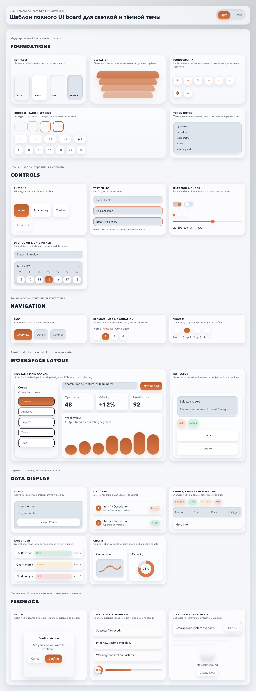
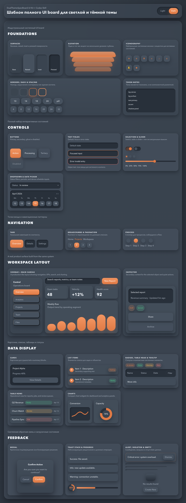
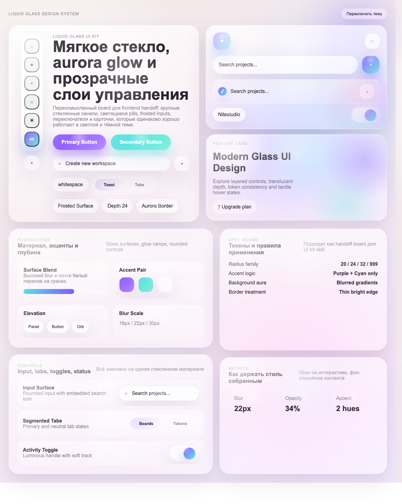
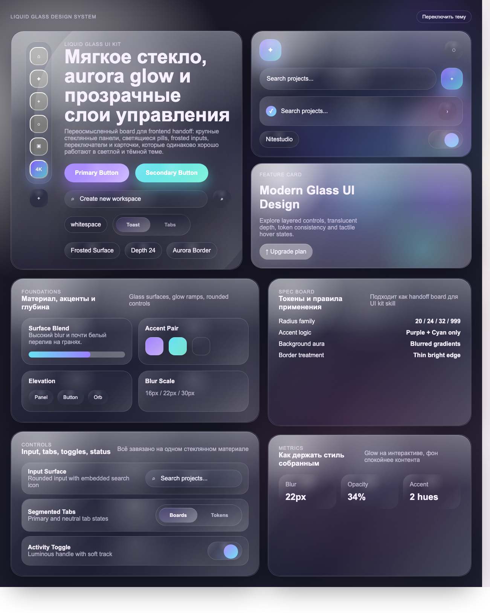
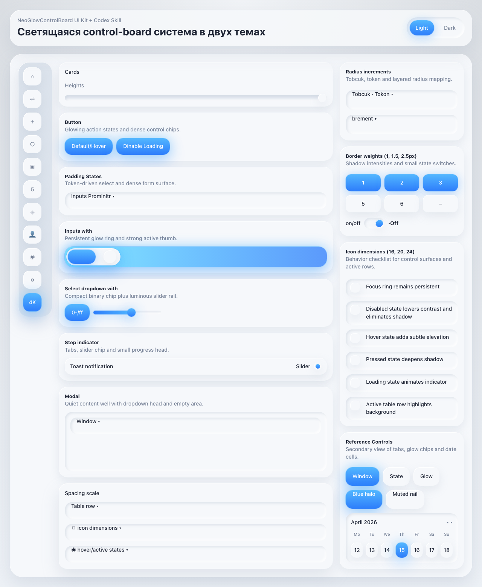
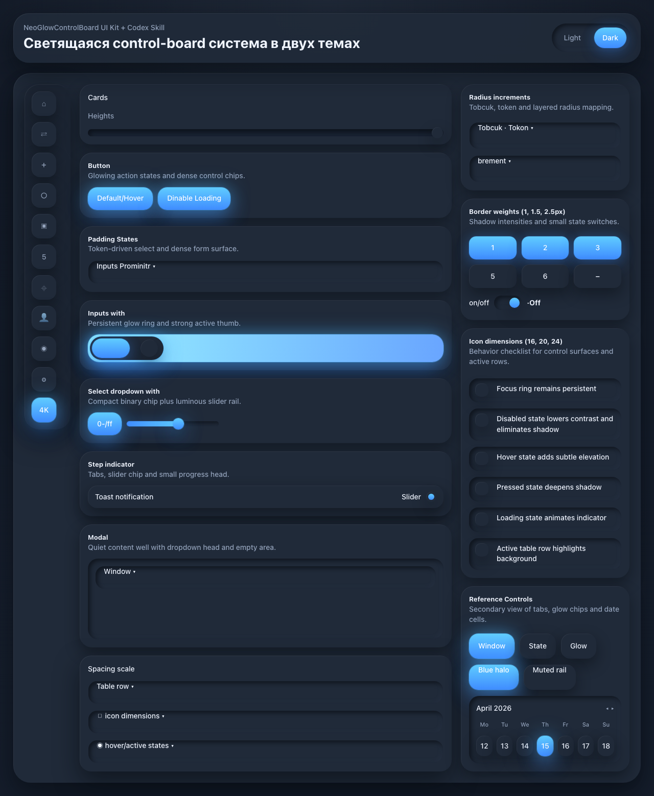
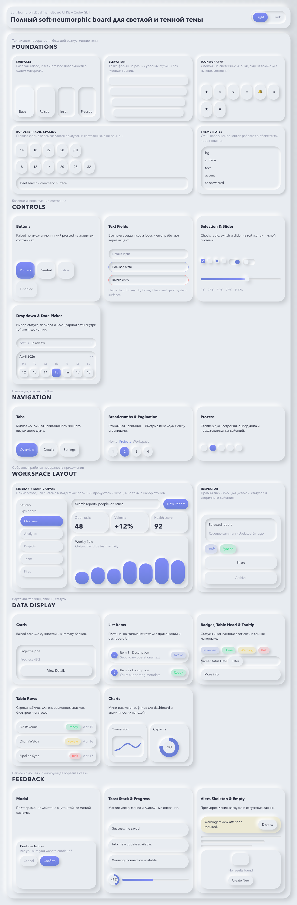
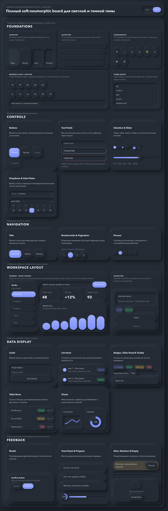

# Codex UI Board Skills

Reusable Codex UI board skills for building polished dual-theme interface systems.

This repository collects open-source Codex skills that package visual direction, design tokens, CSS, Tailwind presets, screenshots, documentation, and standalone HTML previews. The goal is to make it easier to start high-quality SaaS dashboards, admin panels, AI tools, internal tools, and productivity apps with a coherent light and dark design system.

## Why This Exists

Great UI work is easier when the starting point is concrete. A reusable Codex skill can give an agent a complete visual language: the token model, component behavior, preview surface, and implementation references needed to build consistently.

This project exists to provide practical, inspectable UI starter kits for Codex-driven frontend work. Each skill is designed to be copied, installed, previewed, and adapted without requiring a build step.

## Who This Is For

This project is useful for:

- developers using Codex to build or restyle product interfaces
- designers and frontend engineers who want reusable design-system starter kits
- open-source maintainers documenting Codex skills
- teams prototyping SaaS dashboards, admin panels, AI tools, internal tools, and productivity apps
- contributors who want to add new UI board skills with clear structure and expectations

## Included Skills

| Skill | Folder | Best for | Style language |
| --- | --- | --- | --- |
| Dual Theme Spec Board | [`DualThemeSpecBoard`](./DualThemeSpecBoard) | SaaS dashboards, admin tools, workspaces, settings screens | Structured light/dark product UI with broad state coverage |
| Liquid Glass Aurora Board | [`LiquidGlassAuroraBoard`](./LiquidGlassAuroraBoard) | Premium dashboards, AI tools, launchers, glossy settings surfaces | Frosted glass panels, aurora glow, translucent controls |
| Neo Glow Control Board | [`NeoGlowControlBoard`](./NeoGlowControlBoard) | Dense control boards, technical admin panels, QA/spec screens | Compact surfaces with blue/cyan glow on meaningful states |
| Soft Neumorphic Dual Theme Board | [`SoftNeumorphicDualThemeBoard`](./SoftNeumorphicDualThemeBoard) | Dashboards, productivity tools, internal apps, calm workspaces | Tactile soft-neumorphic surfaces in light and dark themes |

## Screenshots

Each skill includes light and dark screenshots in its `screenshots/` folder.

### Dual Theme Spec Board





### Liquid Glass Aurora Board





### Neo Glow Control Board





### Soft Neumorphic Dual Theme Board





## Installation

Clone the repository:

```sh
git clone https://github.com/Dezoff-max/codex-ui-board-skills.git
cd codex-ui-board-skills
```

Install all skills into your local Codex skills directory:

```sh
mkdir -p ~/.codex/skills
cp -R DualThemeSpecBoard/codex-skill ~/.codex/skills/dual-theme-spec-board
cp -R LiquidGlassAuroraBoard/codex-skill ~/.codex/skills/liquid-glass-aurora-board
cp -R NeoGlowControlBoard/codex-skill ~/.codex/skills/neo-glow-control-board
cp -R SoftNeumorphicDualThemeBoard/codex-skill ~/.codex/skills/soft-neumorphic-dual-theme-board
```

Install one skill only:

```sh
mkdir -p ~/.codex/skills
cp -R NeoGlowControlBoard/codex-skill ~/.codex/skills/neo-glow-control-board
```

## Local Preview

Every skill has a standalone `preview.html` that can be opened directly:

```sh
open LiquidGlassAuroraBoard/preview.html
```

Most previews support theme query parameters:

```text
preview.html?theme=light
preview.html?theme=dark
```

Some previews also support capture-safe URLs for screenshots:

```text
preview.html?theme=light&capture=1
preview.html?theme=dark&capture=1
```

## Codex Prompt Examples

Use the skills directly in Codex prompts:

```text
Use $dual-theme-spec-board to design a settings dashboard with light and dark themes.
```

```text
Use $liquid-glass-aurora-board to restyle this AI workspace with premium glass surfaces.
```

```text
Use $neo-glow-control-board to create a dense admin panel with clear active states.
```

```text
Use $soft-neumorphic-dual-theme-board to build a calm productivity dashboard.
```

Good prompts usually include:

- the target product surface
- the desired theme behavior
- any existing design constraints
- whether the result should be a full page, component set, or focused restyle

## Repository Structure

```text
.
├── DualThemeSpecBoard/
├── LiquidGlassAuroraBoard/
├── NeoGlowControlBoard/
├── SoftNeumorphicDualThemeBoard/
├── ROADMAP.md
├── CONTRIBUTING.md
├── SECURITY.md
├── CODE_OF_CONDUCT.md
├── AGENTS.md
└── .github/
```

Each skill folder follows this pattern:

```text
SkillName/
├── README.md
├── package.json
├── preview.html
├── index.css
├── SkillName.css
├── SkillName.tokens.json
├── tailwind.preset.cjs
├── screenshots/
└── codex-skill/
    ├── SKILL.md
    ├── agents/
    ├── assets/
    └── references/
```

## Use CSS Directly

Copy or link a skill stylesheet into a frontend project:

```html
<link rel="stylesheet" href="./NeoGlowControlBoard.css">
```

Then use the preview and CSS class names as the implementation reference. The CSS is intended to be readable and portable.

## Use Tailwind Presets

Each skill includes a `tailwind.preset.cjs` file that maps the skill's design tokens into Tailwind-friendly values.

Example:

```js
module.exports = {
  presets: [require("./NeoGlowControlBoard/tailwind.preset.cjs")],
  content: ["./src/**/*.{js,ts,jsx,tsx,html}"],
};
```

Use the preset when you want the token system available inside an existing Tailwind project. Use the plain CSS when you want a standalone implementation reference.

## Roadmap Summary

Near-term roadmap themes:

- improve documentation and screenshot presentation
- add more example prompts for each skill
- add validation for token files and folder structure
- add automated screenshot generation
- expand the collection with more specialized UI board skills
- add accessibility and quality checklists

See [ROADMAP.md](./ROADMAP.md) for the full roadmap.

## Contributing

Contributions are welcome. Useful contributions include:

- improving documentation
- adding screenshots or examples
- tightening accessibility guidance
- improving design token consistency
- adding new UI board skills
- improving Tailwind preset documentation

Please read [CONTRIBUTING.md](./CONTRIBUTING.md) before opening a pull request.

## How Codex Can Help Maintain This Project

Codex can help with:

- adding new skills from a documented visual direction
- keeping `preview.html`, CSS, tokens, and `codex-skill/references/` in sync
- generating example prompts and usage documentation
- checking for broken links and missing screenshots
- drafting issue templates, roadmap updates, and release notes
- reviewing whether a new skill follows the existing repository conventions

When using Codex in this repository, keep changes small, inspectable, and grounded in the existing folder structure.

## License

MIT License. See [LICENSE](./LICENSE).
