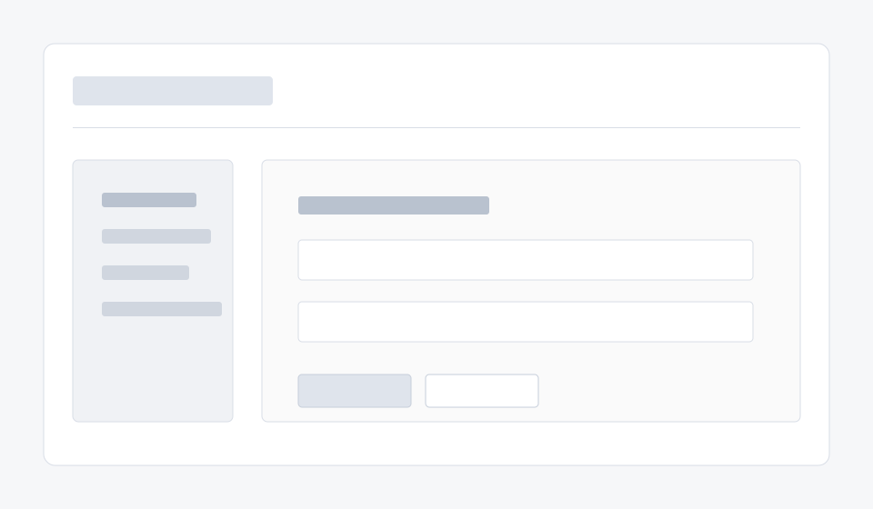

# Frontend PR Workflow Example

This example shows how an OSS maintainer can use a Codex UI board skill during a frontend pull request.

## Scenario

A contributor opens a PR with a functional but visually inconsistent settings dashboard. The maintainer wants to keep the implementation small while improving hierarchy, theme coverage, and reviewability.

## Before



The initial UI has working controls, but weak information hierarchy, little state coverage, and no design-token story.

## Codex Prompt

```text
Use $dual-theme-spec-board to restyle this settings dashboard. Keep the existing React component boundaries and form behavior. Add a coherent light/dark token model, clear active/disabled/error states, and a compact admin-panel layout.
```

## After


The reviewed UI now has a documented visual language, reusable CSS, token-backed states, and screenshots that make follow-up review easier.

## Maintainer Checklist

- Run `npm run validate`.
- Confirm screenshots changed only when visual output changed.
- Confirm `codex-skill/references/` files match top-level CSS, tokens, preview, and Tailwind preset.
- Ask Codex to summarize the PR diff and flag missing states.
- Merge only after CI and visual review pass.
